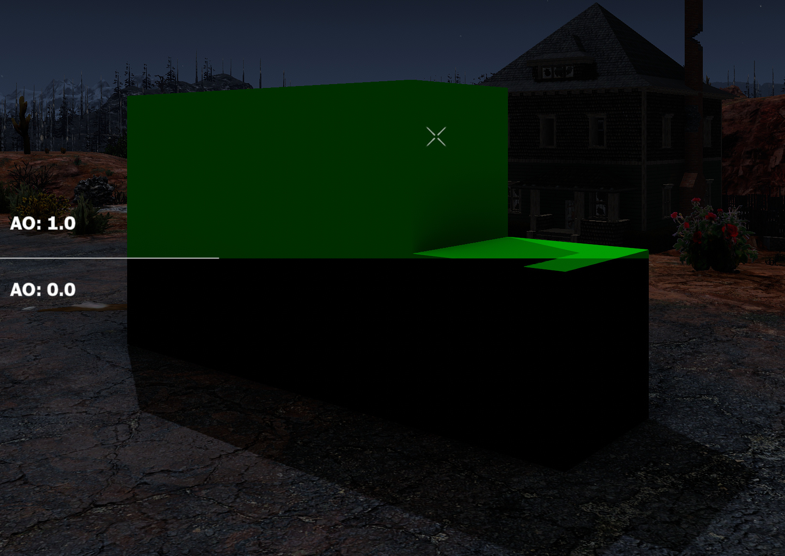

# OCB Core Mod for Custom Texture Atlas  - 7 Days to Die (V1.0 exp) Addon

This mod doesn't do much on it's own, but it allows other mods to
add custom (opaque) block paints and grass/plant textures.

See demo mods some sample configs and resources!

- https://github.com/OCB7D2D/OcbCustomTexturesPaints
- https://github.com/OCB7D2D/OcbCustomTexturesPlants

[![GitHub CI Compile Status][10]][9]

### Download and Install

End-Users are encouraged to download my mods from [NexusMods][11].  
Every download there helps me to buy stuff for mod development.

Otherwise please use one of the [official releases][12] here.  
Only clone or download the repo if you know what you do!

## Custom Block Paints

Block paints are internally handled by a [`Texture2DArray`][1], which
is only available since recent times (e.g. [OpenGL 3][2]). This means
we have some limitations here, as every texture in the array must be
of the same dimension (512x512), type and the same mipmap levels.
You achieve this with correct texture settings in unity.


Make sure exported textures are in the following texture formats (512x512):

- Diffuse in DXT1 (BC1) => RBG 565 format (no alpha channel)
- Normals in DXTnm => using green (6 bit) and alpha (8 bit) channel
- "Specular" (MOER) in DXT5 (BC3) => RGBA 5658 format (4 channel texture)

Note: In case you are supplying a texture for "specular" with a fully
opaque alpha channel, unity may decide to use DXT1 (BC1) as the proper
export texture format. This will not be compatible with the expected
texture format of DXT5 (BC3) and will result in `CopyTexture` errors.
You can either use a nearly opaque alpha/roughness channel (254), or
alternatively force the export format via:


For the diffuse to automatically take the right export format, it should
be enough to disable the transparency via "Alpha Source None" (as shown).

You can use [AssetStudio][3] to check the exported `unity3d`
resource to see the format of your textures. If the formats
are not correct, the code will either outright reject your
new texture or you can expect to see weird visual glitches!


For lower texture resolutions we "resize" the texture accordingly.
Actually we don't really resize it, but we simply re-use the
existing texture mipmaps to create lower dimension renditions.

### XML Config For Custom Paints

`Config/painting.xml`:

```xml
<configs><append xpath="/paints">
  <!-- id: the name for your new custom opaque texture -->
  <!-- x/y: offset for the UVs to offset the texture start -->
  <!-- w/h: width and height for how to paint the given textures, must not be zero! -->
  <!-- blockw/blockh: width and height to influence paint preview?, must not be zero! -->
  <opaque id="bark_pine_all_faces" texture="txName_bark_pine_all_faces" x="0" y="0" w="2" h="2" blockw="2" blockh="2">
    <!-- Albedo/Diffuse texture is absolutely necessary, how else would you want to paint a block? -->
    <property name="Diffuse" value="#@modfolder:Resources/Atlas.unity3d?assets/bark_pine_002_diffuse.jpg,assets/bark_pine_001_diffuse.jpg,assets/bark_pine_002_diffuse.jpg,assets/bark_pine_003_diffuse.jpg"/>
    <!-- Normal texture is also a must, although you may provide a fully neutral one [rgb => 0.5, 0.5, 1] (translating to normal vector [0, 0, 1]) -->
    <property name="Normal" value="#@modfolder:Resources/Atlas.unity3d?assets/bark_pine_002_normal.jpg,assets/bark_pine_001_normal.jpg,assets/bark_pine_002_normal.jpg,assets/bark_pine_003_normal.jpg"/>
    <!-- Optional "Specular" texture is a packed textures, containing four different parameters for the shader, see explanation further below -->
    <property name="Specular" value="#@modfolder:Resources/Atlas.unity3d?assets/bark_pine_002_pbr.png,assets/bark_pine_001_pbr.png,assets/bark_pine_002_pbr.png,assets/bark_pine_003_pbr.png"/>
    <!-- How much paint it will cost users -->
    <property name="PaintCost" value="1" />
    <!-- Hide paint from options for users to choose -->
    <!-- This flag does nothing in editor/creative mode -->
    <property name="Hidden" value="false"/>
    <!-- Disable for textures to rotate with block -->
    <property name="GlobalUV" value="False"/>
    <!-- Group for sorting paints in UI -->
    <property name="Group" value="txGroupCustom"/>
    <!-- Fine tune sorting withing groups -->
    <property name="SortIndex" value="255"/>
    <!-- not sure why vanilla has this!? -->
    <!-- seems unused in vanilla configs -->
    <property name="Material" value="wood" />
    <!-- no idea what color property does, but it is parsed!? -->
    <!-- code indicates something with particle system color -->
    <property name="Color" value="0.48,0.35,0.29"/>
    <!-- assuming this will mirror/switch the texture? -->
    <!-- altough I can't seem to find it used anywhere! -->
    <property name="SwitchUV" value="False"/>
  </opaque>
</append></configs>
```

#### High resolution opaque block textures

Although the texture array only supports 512x512 textures, the game
supports to have multiple textures to span over multiple blocks. This
basically allows you to have 1k textures, which is how most block paints
are in vanilla, or even bigger ones. To achieve this you have to split
your bigger texture into 512x512 bits and setup the xml accordingly.

In the example above 4 textures are used, so we need to set `w` and `h`
to `2x2` repectively. Could also use `w="4" h=1"` for a different pattern.
It seems that `blockw` and `blockh` should just be set to the same value.

#### Reference custom textures in new/existing blocks

To use custom textures in predefined blocks, use this syntax:

`Config/blocks.xml`

```xml
<block name="demo_block">
  <property name="Texture" value="demo_terrain"/>
</block>
```

These blocks can then be used in your prefabs or to be built by users directly.
This is much more efficient than creating new block meshes for your overhauls.

#### Overwrite existing opaque block/paint textures

To overwrite any existing texture in the atlas, you just need to
define the id as the number of the texture ID you want overwritten:
E.g. `<opaque id="65" ... >` to overwrite `Plywood` textures.

### Optional PBR Standard shader packing format

The shader for the opaque blocks additionally can use another optional
texture named "Specular". Unfortunately that name was inherited from vanilla
7D2D, as it seems to actually be a PBR (metallic/roughness/AO) setup instead.

This (DXT5 sRGB) texture uses all four channels to cary material parameters:

> R: Metallic, G: Ambient Occlusion, B: Emission, A: Roughness

You can pack the source textures for these parameters via an image processor
of your choice, or (recommended) via a channel packer script, e.g.:
https://github.com/OCB7D2D/UnityTextureChannelPacker


This will create a "specular" texture that is a little bit metallic (R),
receives most of the ambient light (G), is non-emissive (B) and is only
a tiny bit smooth/nearly fully rough (A).

#### Note on the emission parameter (blue channel)

While most regular shaders accept a dedicated RGB texture for the emission,
this shader only accepts a single channel (blue). It acts as a factor to
included the regular albedo/diffuse texture regardless of lighting. If your
source material has a distinct emission texture, you will need to mangle it
with your albedo texture and mark the emissive parts in the blue channel.

### Generate "specular" texture (Metallic/AO/Emission/Roughness)

It's recommended to provide all three textures for an opaque block paint.
This is most important for albedo and for the normal texture, although you
may also use a uniform color texture for Albedo. Most material textures you
find on the net will provide at least those two, but sometimes they're missing
the Metallic, Roughness/Smoothness and/or Ambient Occlusion texture.

Although you can use any image editor to create the combined channel texture,
I highly recommend to use something like my [Texture Channel Packer][8] to
ensure that the resulting image really contains the raw data in all channels.

If you e.g. leave the "specular" texture blank, it will fallback to a 
uniform black texture (0,0,0,1). This means the material rendering will
be non-metallic, receives no ambient light, is non-emissive with maximum
roughness. Although this still works, the value for AO is certainly too
low, as most materials want to recieve at least some ambient lighting.



That's also the reason why most dumped "speculars" have a green tint.

### Generate uniform textures on the fly in xml config

As an experimental feature you can use a specific syntax to define uniform
textures on the fly in your xml config. I don't really recommend doing it
for production stuff, as you can easily create those textures also in unity
and export them properly, to avoid any runtime overhead. But for experimenting
it can be usefull if you want to play around with various material parameters.

The following will produce a uniform opaque black texture:

```xml
<property name="Specular" value="512:512:0:0:0:1"/>
```

Example setting for a "specular" texture for a dull material:

```xml
<property name="Specular" value="512:512:0.05:0.8:0:0.975"/>
```


## Custom grass/plant textures

Grass textures are stored in an "old-school" image atlas, aka sprite atlas.
Meaning that all textures are merged into one big texture and models/meshes
just reference the partial square via UV coordinates. In order to patch such
an existing atlas, we first and foremost need to know what parts are already
used and which parts are free to re-use. In the end I implemented a pretty
sophisticated workflow to enable patching of such atlases.

- Reading existing sub-textures from old atlas
- Done by evaluating the existing XML UV mappings
- All sub-textures are cut out from the existing atlas
- Then we add the newly added sub-textures to that array
- Once done, we create a new atlas and update all UV configs

See https://github.com/OCB7D2D/OcbCustomTexturesPlants for more info

## Custom Terrain Textures

All custom terrain features will be moved to my new [MicroSplat core mod][7].  
Note that at the time of writing this, that work hasn't been released yet.

See https://github.com/OCB7D2D/OcbMicroSplat

## Further notes

Vanilla has two additional configs for paints:

- string LockedByPerk;
- ushort RequiredLevel;

These seem implemented fully, but unused for now!

## Changelog

### Version 0.7.2

- Recompile for 7D2D V1.2 stable

### Version 0.7.1

- Recompile for 7D2D V1.1 stable

### Version 0.7.0

- Update compatibility for 7D2D V1.0 (exp)
- Verified compatibility with V1 stable (b333)

### Version 0.6.0

- Update compatibility for 7D2D A21.1(b6)

### Version 0.5.0

- Allow to overwrite existing MicroSplat textures

### Version 0.4.2

- Fix dedicated server issue with custom grass textures

### Version 0.4.1

- Remove verbose debug log spam

### Version 0.4.0

- Implement custom MicroSplat terrain blends

### Version 0.3.1

- Allow to overwrite existing paint textures

### Version 0.3.0

- Add experimental grass atlas patching
- "live" helper functions via CMD options
- Fix UV ID assignment

### Version 0.2.1

- Fix for dedicated servers

### Version 0.2.0

- Major code refactoring
- Loading speed improvements

### Version 0.1.0

- Initial version

[1]: https://docs.unity3d.com/ScriptReference/Texture2DArray.html
[2]: https://www.khronos.org/opengl/wiki/Array_Texture
[3]: https://github.com/Perfare/AssetStudio
[4]: https://github.com/OCB7D2D/OcbCustomTexturesPaints
[5]: https://gitlab.com/sphereii/SphereII-Mods/-/archive/master/SphereII-Mods-master.zip?path=SphereII%20Legacy%20Distant%20Terrain
[6]: https://assetstore.unity.com/packages/tools/terrain/microsplat-96478
[7]: https://github.com/OCB7D2D/OcbMicroOcbCustomTexturesSplat
[8]: https://github.com/OCB7D2D/UnityTextureChannelPacker
[9]: https://github.com/OCB7D2D/OcbCustomTextures/actions/workflows/ci.yml
[10]: https://github.com/OCB7D2D/OcbCustomTextures/actions/workflows/ci.yml/badge.svg
[11]: https://www.nexusmods.com/7daystodie/mods/2788
[12]: https://github.com/OCB7D2D/OcbCustomTextures/releases
